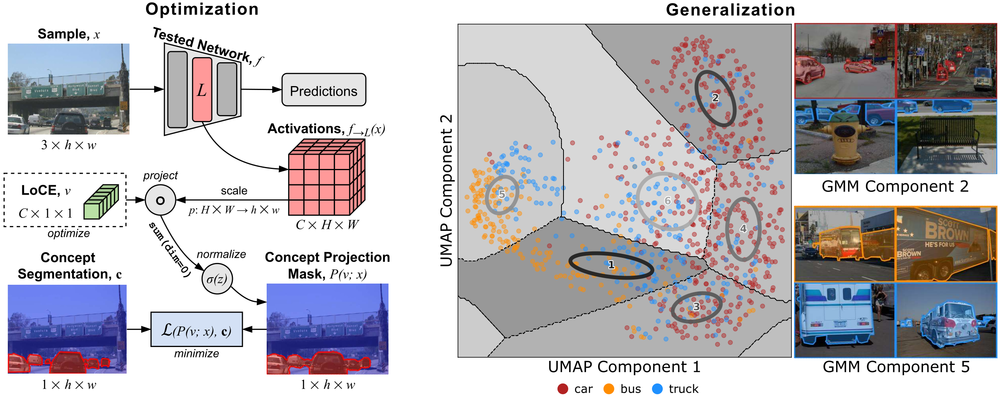
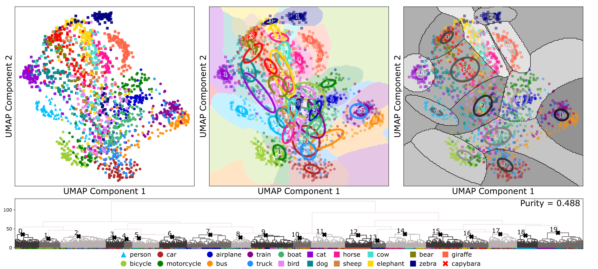
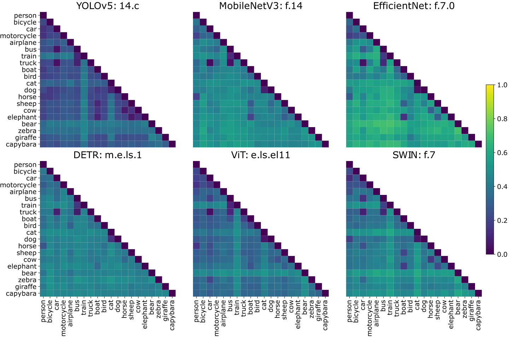
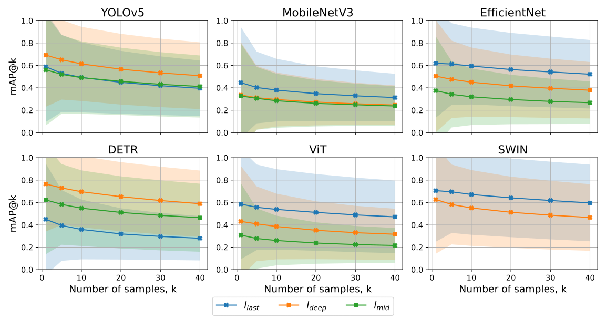

# Local Concept Embeddings for Analysis of Concept Distributions in Vision DNN Feature Spaces

> Mikriukov, Georgii, Gesina Schwalbe, and Korinna Bade. "Local Concept Embeddings for Analysis of Concept Distributions in DNN Feature Spaces." arXiv preprint arXiv:2311.14435 (2023).

```
@article{mikriukov2023loce,
  title={Local Concept Embeddings for Analysis of Concept Distributions in DNN Feature Spaces}, 
  author={Georgii Mikriukov and Gesina Schwalbe and Korinna Bade},
  year={2024},
  eprint={2311.14435},
  archivePrefix={arXiv},
  primaryClass={cs.CV},
  url={https://arxiv.org/abs/2311.14435},
}
```


# LoCE: Local Concept Embeddings and Their Distributions

**LoCEs** (Local Concept Embeddings) analyze how deep neural networks (DNNs) represent concepts in their latent feature spaces. Unlike traditional global concept methods that assign a single vector to each concept, **LoCEs** generate a separate embedding for each individual sample. Thus, **LoCEs** can capture:

- **Sub-concepts** – Variations within a concept, such as **near car** vs. **distant car**.
- **Concept Overlap** – Cases where different concepts have similar representations, like **bus** and **truck**.
- **Concept-vs-Context Encoding** – Representation of a concept in contrast to its specific background, like **cat on the sofa with dog in the background**.

For example, **LoCEs** can be used for:

- **Concept Understanding** – Analysis of how a model distinguishes between different objects and their contexts.
- **Sub-Concept Discovery** – Identification of finer details within a concept.
- **Concept Confusion Detection** – Identification of cases where a model struggles to differentiate between similar objects.
- **Outlier Detection** – Detection of unusual or mislabeled data points.
- **Information Retrieval** – Retrieval of images based on concept similarity in feature space.


### Optimization and Generalization



(*left*) **LoCE** optimization for an image-concept pair: **LoCE** *v* represents the optimal convolutional filter weights that *project* Sample's *x* Activations *fₗ(x)* from layer *L* into the Concept Projection Mask *P(v; x)*, aiming to reconstruct the target Concept Segmentation *C* with minimal loss *L(P(v; x), C)*.

(*right*) Distribution of 2D UMAP-reduced **LoCEs** demonstrating the confusion of **car**, **bus**, and **truck** concepts in `DETR.model.encoder.layers.1`. Gaussian Multinomial Mixture (GMM) is fitted to **LoCEs** to highlight the structure. Additionally, some samples from GMM components 2 and 5 are demonstrated.


### Clustering and Distribution Analysis



Generalization of tested concept **LoCEs** of MS COCO and Capybara Dataset in `DETR.model.encoder.layers.1`:

- 2D UMAP-reduced **LoCEs** of every tested category (*top-left*)
- GMMs fitted for **LoCEs** with regard to their labels (*top-middle*)
- GMMs fitted for all **LoCEs** regardless of their labels (*top-right*)
- **LoCEs** dendrogram with identified clusters (*bottom*)

### Model comparison: Concept Separation



Pairwise Concept Separation (one-vs-one) in different layers of different models estimated with **LoCEs**.

### Model comparison: Concept-vs-Context Retrieval



Concept-vs-context, i.e., concept-vs-background, information retrieval with **LoCEs** in complex scenes of MS COCO. mAP@k performance averaged for all tested concepts across models and increasing layer depth.


# Demo 


### Installation

1. Download repo
```
git clone https://github.com/local-concept-embeddings.git
```

2. Create & activate venv (optionally)

We used Python 3.9.17

```
python -m venv test_venv
source ./test_venv/bin/activate
```

3. Install requirements
```
pip install -r requirements.txt
```


### Download MS COCO 2017 annotations + validation subset (240 MB + 780 MB):
Execute: `./data/download_ms_coco_2017val_dataset.sh`

Data and annotations folder: `./data/mscoco2017val/`


### Try Jupyter Notebooks

1. Optimize LoCEs: `./demo/1_optimize.ipynb`
2. Experiments on LoCE distributions (Purity, Separation,  Overlap, and Confusion): `./demo/2_distibution_purity_separation_overlap_confusion.ipynb`
3. Concept-based Retrieval and Outlier Retrieval: `./demo/3_retrieval_and_outliers.ipynb`
2. Sub-concepts inspection: `./demo/4_subconcepts.ipynb`


### If you want to use PASCAL VOC 2012 (1.9 GB):

Execute: `./data/download_pascal_voc2012.sh`

Run (convert VOC to COCO JSON): `python ./data/voc2coco.py`

Data and annotations folder: `./data/voc2012/VOCdevkit/VOC2012/`


# Folders

```
├── data                  <- Datasets / processed data / data cache.
├── demo                  <- Demonstration files.
├── experiment_outputs    <- (will be created by ./demo/*.ipynb).
├── src                   <- Source files of method.
│   ├── data_structures   <- Data structures: Data loaders, data processors etc.
│   ├── hooks             <- Extraction of activations and gradients.
│   ├── loce              <- Method scripts.
│   ├── xai_utils         <- Various utils.
```


# Documentation

For further help, see the API-documentation or contact the maintainers.


# License

Copyright (C) 2025 co-pace GmbH (a subsidiary of Continental AG). All rights reserved.
